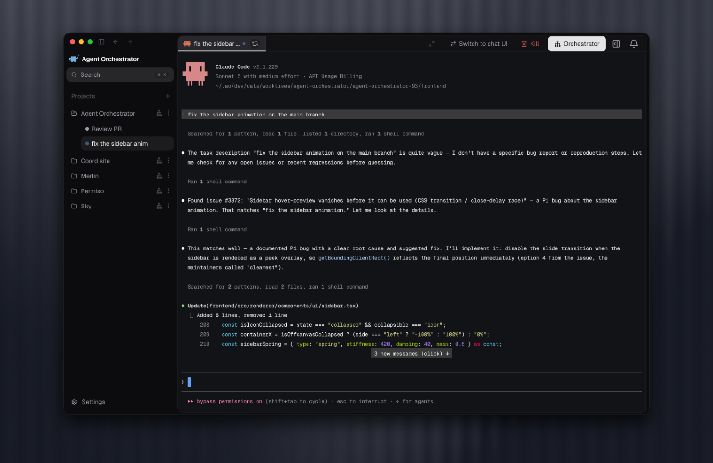
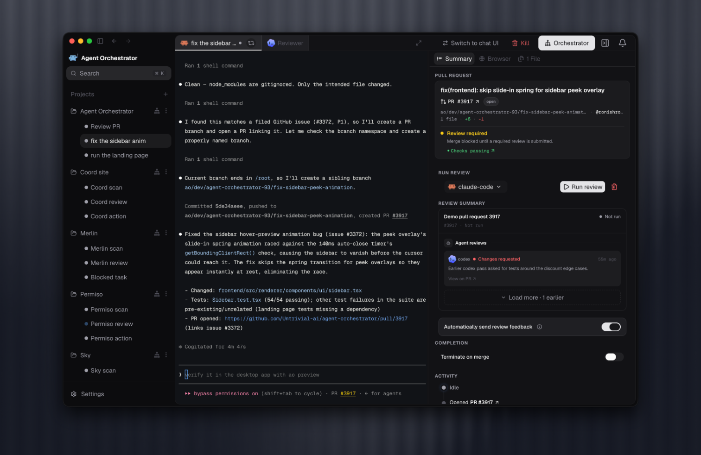
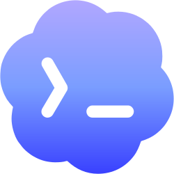
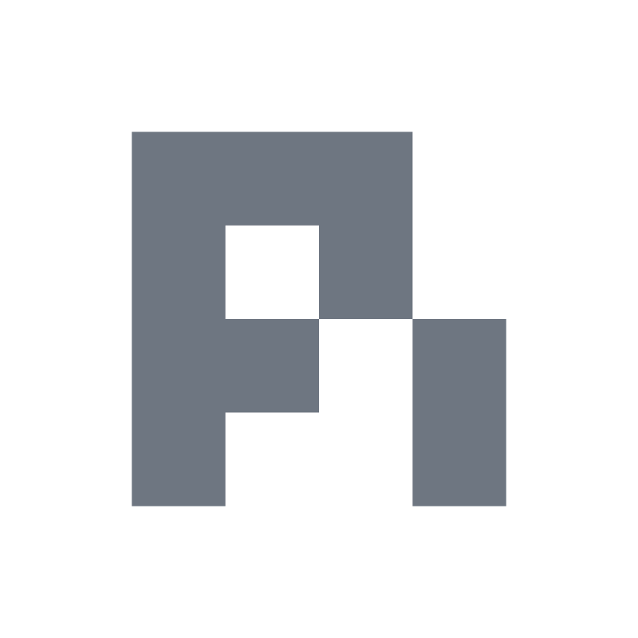
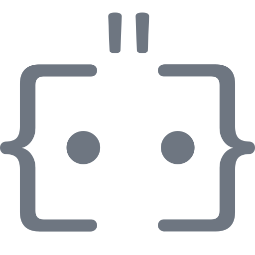

<div align="center">
  

### Agent Orchestrator

#### The orchestration layer for parallel AI coding agents

[](https://github.com/Untrivial-ai/agent-orchestrator/stargazers)

[](https://github.com/Untrivial-ai/agent-orchestrator/releases/latest)
[](https://github.com/Untrivial-ai/agent-orchestrator/releases)
[](LICENSE)
[](https://x.com/aoagents)
[](https://discord.com/invite/UZv7JjxbwG)

Run Claude Code, Codex, Cursor, opencode, and other coding agents in parallel.<br />
Git-backed sessions get isolated worktrees; Scratch sessions get AO-managed branchless directories.<br />
Every session gets a live interface and its own feedback loop.

[**Download AO**](#install) &nbsp;&bull;&nbsp; [Documentation](https://aoagents.dev/docs) &nbsp;&bull;&nbsp; [Releases](https://github.com/Untrivial-ai/agent-orchestrator/releases) &nbsp;&bull;&nbsp; [Contributing](CONTRIBUTING.md) &nbsp;&bull;&nbsp; [Discord](https://discord.com/invite/UZv7JjxbwG)

**English** · [简体中文](translations/README.zh-CN.md) · [日本語](translations/README.ja.md) · [한국어](translations/README.ko.md) · [Español](translations/README.es.md) · [Français](translations/README.fr.md) · [Deutsch](translations/README.de.md) · [Português (Brasil)](translations/README.pt-BR.md)

<br />


</div>

## Run more agents without managing more terminals

Agent Orchestrator is a local agent IDE for running AI coding agents in parallel. For Git-backed sessions, it brings an isolated worktree, branch, and pull request together with the Chat or terminal interface, browser preview, and feedback state in one supervisor. Scratch sessions use AO-managed branchless directories without pull request operations.

The agents still do the coding. AO provides the control layer around them:

- **Work in parallel without collisions** — Git-backed sessions get their own branch and worktree; every session gets its own terminal
- **See what needs attention** — track which agents are working, waiting, finished, or blocked
- **Close the feedback loop** — route CI failures, review comments, and merge conflicts back to the right session
- **Use the right agent for each task** — supervise different agent CLIs from one desktop app

Instead of coordinating a pile of agent terminals by hand, you get one visible, managed workflow.

## Features

<table>
  <tr>
    <td width="36%" valign="middle">
      <h3>Parallel agent sessions</h3>
      <p>Start multiple coding agents from the same project without mixing files, branches, terminals, or pull request state.</p>
    </td>
    <td width="64%">
      
    </td>
  </tr>
  <tr>
    <td width="36%" valign="middle">
      <h3>Chat and terminal control</h3>
      <p>Use a structured Chat controller or attach to the agent's native terminal UI while keeping session and pull request state in view.</p>
    </td>
    <td width="64%">
      
    </td>
  </tr>
  <tr>
    <td width="36%" valign="middle">
      <h3>Review feedback loops</h3>
      <p>Run reviewer agents, inspect review status, and route requested changes back to the worker that owns them.</p>
    </td>
    <td width="64%">
      
    </td>
  </tr>
  <tr>
    <td width="36%" valign="middle">
      <h3>In-app browser preview</h3>
      <p>Preview a session's local app beside its interface so UI work, browser state, and agent output stay together.</p>
    </td>
    <td width="64%">
      
    </td>
  </tr>
</table>

## How AO works

1. Add a project and start one or more agent sessions from the desktop app or CLI.
2. AO creates an isolated worktree for each Git-backed session, or an AO-managed branchless directory for Scratch, then launches the selected Chat or terminal interface.
3. The local daemon watches controller activity, pull requests, CI, review feedback, and merge conflicts.
4. The app and CLI keep every session visible and let you send follow-up instructions to the right agent.

AO stays local and supervisory: your coding agents keep doing the implementation while AO organizes their workspaces, state, interfaces, and feedback.

## Supported agents

**26 coding agents supported** through one supervised workflow.

<table>
  <tr valign="middle">
    <td width="33%" valign="middle" nowrap> &nbsp; <b>Claude Code</b></td>
    <td width="33%" valign="middle" nowrap> &nbsp; <b>Codex</b></td>
    <td width="33%" valign="middle" nowrap> &nbsp; <b>Cursor</b></td>
  </tr>
  <tr valign="middle">
    <td valign="middle" nowrap> &nbsp; <b>opencode</b></td>
    <td valign="middle" nowrap> &nbsp; <b>Aider</b></td>
    <td valign="middle" nowrap> &nbsp; <b>GitHub Copilot</b></td>
  </tr>
  <tr valign="middle">
    <td valign="middle" nowrap> &nbsp; <b>Grok</b></td>
    <td valign="middle" nowrap> &nbsp; <b>Kimi</b></td>
    <td valign="middle" nowrap> &nbsp; <b>Pi</b></td>
  </tr>
  <tr valign="middle">
    <td valign="middle" nowrap> &nbsp; <b>Amp</b></td>
    <td valign="middle" nowrap> &nbsp; <b>Auggie</b></td>
    <td valign="middle" nowrap> &nbsp; <b>Droid</b></td>
  </tr>
  <tr valign="middle">
    <td valign="middle" nowrap> &nbsp; <b>Crush</b></td>
    <td valign="middle" nowrap> &nbsp; <b>Cline</b></td>
    <td valign="middle" nowrap> &nbsp; <b>Goose</b></td>
  </tr>
  <tr valign="middle">
    <td valign="middle" nowrap> &nbsp; <b>Qwen</b></td>
    <td valign="middle" nowrap> &nbsp; <b>Continue</b></td>
    <td valign="middle" nowrap> &nbsp; <b>Devin</b></td>
  </tr>
  <tr valign="middle">
    <td valign="middle" nowrap> &nbsp; <b>Kiro</b></td>
    <td valign="middle" nowrap> &nbsp; <b>Kilo Code</b></td>
    <td valign="middle" nowrap> &nbsp; <b>Vibe</b></td>
  </tr>
  <tr valign="middle">
    <td valign="middle" nowrap> &nbsp; <b>Muse</b></td>
    <td valign="middle" nowrap> &nbsp; <b>Agy</b></td>
    <td valign="middle" nowrap><picture><source media="(prefers-color-scheme: dark)" srcset="docs/assets/readme/agents/autohand-stacked-dark.png" /></picture> <b>Autohand</b></td>
  </tr>
  <tr valign="middle">
    <td valign="middle" nowrap> &nbsp; <b>Kimchi</b></td>
    <td valign="middle" nowrap> &nbsp; <b>Prime Agent</b></td>
    <td valign="middle" nowrap></td>
  </tr>
</table>

[Browse agent setup guides →](https://aoagents.dev/docs/plugins/agents)

**Use the interface that fits the moment: structured Chat or the agent's native terminal UI.**

## Install

Download the latest desktop build for your platform. The desktop app is the recommended, auto-updating install path.

| Platform              | Download                                                                                                                      |
| --------------------- | ----------------------------------------------------------------------------------------------------------------------------- |
| macOS (Apple silicon) | [Download](https://github.com/Untrivial-ai/agent-orchestrator/releases/latest/download/agent-orchestrator-darwin-arm64.dmg)   |
| macOS (Intel)         | [Download](https://github.com/Untrivial-ai/agent-orchestrator/releases/latest/download/agent-orchestrator-darwin-x64.dmg)     |
| Windows               | [Download](https://github.com/Untrivial-ai/agent-orchestrator/releases/latest/download/agent-orchestrator-win32-x64.exe)      |
| Linux (AppImage)      | [Download](https://github.com/Untrivial-ai/agent-orchestrator/releases/latest/download/agent-orchestrator-linux-x64.AppImage) |
| Linux (Debian/Ubuntu) | [Download](https://github.com/Untrivial-ai/agent-orchestrator/releases/latest/download/agent-orchestrator-linux-x64.deb)      |
| Linux (Fedora/RHEL)   | [Download](https://github.com/Untrivial-ai/agent-orchestrator/releases/latest/download/agent-orchestrator-linux-x64.rpm)      |

Open Agent Orchestrator and point it at the repository you want AO to manage. The desktop app runs the daemon for you, so no CLI is required. See the [installation guide](https://aoagents.dev/docs/installation) for agent CLI setup and troubleshooting.

<details>
<summary>Install via npm (legacy CLI, no longer recommended)</summary>

`0.10.0` was the final version published to npm. The frozen `@aoagents/ao` package remains available for existing users who already have `ao` on their `PATH`; `ao start` fetches and opens the desktop build. For new setups, use the desktop download above.

```bash
npm install -g @aoagents/ao
ao start
```

</details>

## Develop and contribute

Contributions are welcome across code, docs, triage, examples, and tests.

```bash
git clone https://github.com/Untrivial-ai/agent-orchestrator.git
cd agent-orchestrator
```

Start with the [development guide](docs/development.md) for prerequisites, local setup, and test commands. Read [CONTRIBUTING.md](CONTRIBUTING.md) before opening a pull request, and use [GitHub Issues](https://github.com/Untrivial-ai/agent-orchestrator/issues) for bugs and feature requests.

## Documentation

| Document                                                         | Start here when you need                                                                     |
| ---------------------------------------------------------------- | -------------------------------------------------------------------------------------------- |
| [Product documentation](https://aoagents.dev/docs)               | Installation, agent setup, and day-to-day product usage.                                     |
| [docs/architecture.md](docs/architecture.md)                     | Backend mental model, lifecycle, persistence, CDC, status derivation, and daemon boundaries. |
| [docs/backend-code-structure.md](docs/backend-code-structure.md) | Package ownership and where each backend concern belongs.                                    |
| [docs/cli/README.md](docs/cli/README.md)                         | CLI behavior and daemon route mapping.                                                       |
| [docs/development.md](docs/development.md)                       | Prerequisites, build steps, running tests, and troubleshooting for local development.        |
| [docs/STATUS.md](docs/STATUS.md)                                 | What currently ships on `main` and what remains in flight.                                   |

## Follow the journey

<table>
  <tr>
    <td width="50%" align="center">
      <a href="https://x.com/agent_wrapper/status/2026329204405723180">
        
      </a>
    </td>
    <td width="50%" align="center">
      <a href="https://x.com/agent_wrapper/status/2025986105485733945">
        
      </a>
    </td>
  </tr>
</table>

## Community

Join [Discord](https://discord.com/invite/UZv7JjxbwG) for help and contributor discussion, follow [@aoagents](https://x.com/aoagents) for updates, or start a conversation in [GitHub Issues](https://github.com/Untrivial-ai/agent-orchestrator/issues).

## Anonymous telemetry

AO uses privacy-preserving product usage and reliability metrics—designed to exclude PII and project content—to understand adoption and improve the product. [Learn more about telemetry and privacy](docs/telemetry.md).

## License

Agent Orchestrator is available under the [Apache License 2.0](LICENSE).
